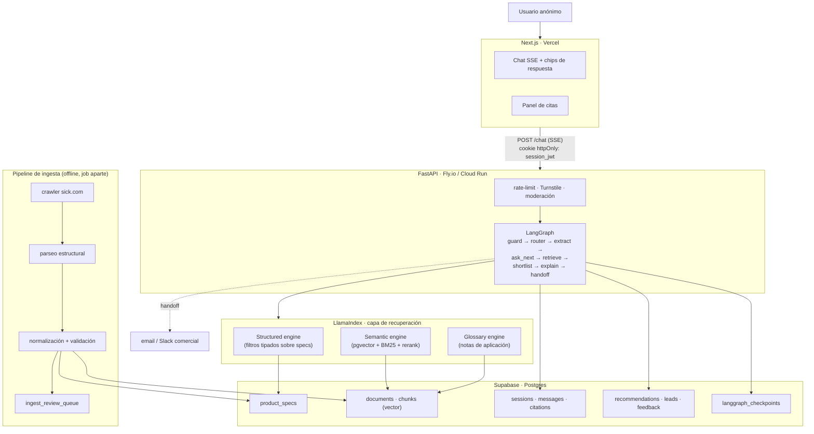
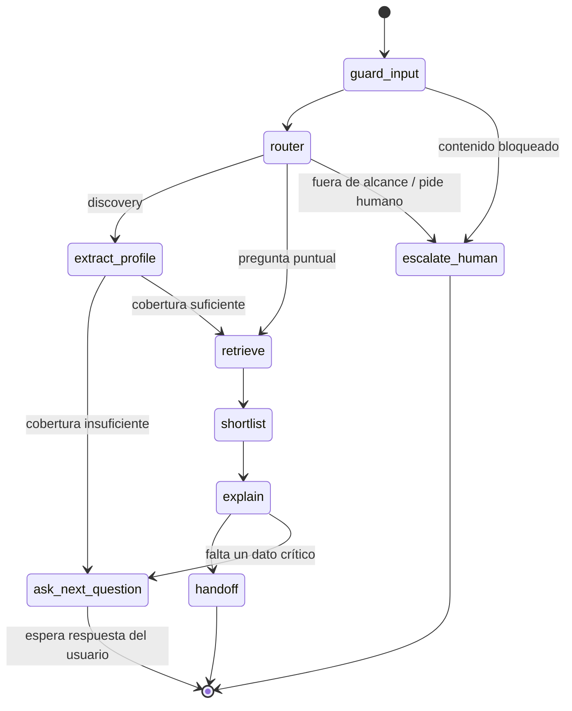

# SICK Safety Advisor — Arquitectura

Agente conversacional de orientación (top-of-funnel) para clientes de SICK que necesitan
proteger **zonas fijas** en entornos industriales. El usuario describe su problema en
lenguaje no técnico y el agente, de forma iterativa, construye un perfil de requisitos,
propone una preselección de producto con trazabilidad a la documentación oficial y termina
derivando a un ingeniero de seguridad.

- **Stack:** LangGraph (agente) · LlamaIndex (RAG) · FastAPI (backend) · Next.js (frontend) · Supabase/Postgres (persistencia + pgvector)
- **Sin login.** Sesiones anónimas persistentes.
- **Estado:** documento de diseño. Todavía no hay código.

---

## 1. Qué es y qué NO es

**Es** una herramienta de orientación comercial que acelera la conversación entre el cliente
y un ingeniero de SICK: traduce lenguaje de planta a lenguaje técnico, acota el catálogo y
entrega un resumen estructurado al equipo comercial.

**No es** un dictamen de seguridad funcional. Esto no es una limitación del modelo, es el
marco normativo:

| El agente puede | El agente NO puede |
|---|---|
| Explicar qué familia de producto aplica a un tipo de protección | Declarar que una configuración "cumple" PL o SIL |
| Explicar la fórmula de distancia mínima y qué datos hacen falta | Dar la distancia mínima de seguridad como cifra final |
| Citar especificaciones de la documentación oficial | Sustituir la evaluación de riesgos del integrador |
| Preseleccionar 2–3 candidatos con sus tradeoffs | Firmar la selección |

El **PL requerido** sale de la evaluación de riesgos (ISO 12100, ISO 13849-1) y la
**distancia mínima** depende del tiempo de parada de la máquina (ISO 13855). Ninguno de los
dos es derivable de una conversación de chat. Por eso `handoff` es un **estado terminal
obligatorio** del grafo, no un CTA opcional.

Normas de referencia relevantes: ISO 12100, ISO 13849-1, IEC 62061, ISO 13855, IEC 61496-1/-3.

---

## 2. Vista de componentes



---

## 3. Decisiones

### Tomadas

| Decisión | Elección | Motivo |
|---|---|---|
| Fuente de documentación | **Scraping de sick.com** | No hay acceso bulk/API disponible |
| Alcance del MVP | **Escáneres láser de seguridad** (nanoScan3, microScan3, outdoorScan3) | Un árbol de decisión acotado para validar el pipeline end-to-end |
| Destino del lead | **Supabase + notificación** (email/Slack) | Sin dependencia de CRM en el MVP; se aísla detrás de un puerto |
| Idiomas | **ES + EN**, embeddings multilingües | Documentación fuente en EN/DE, cliente hispanohablante |
| Vector store | **pgvector en Supabase** | Una sola infraestructura; revisable si el corpus supera ~10⁵ chunks |
| Modelo del agente | **`claude-opus-5`**, adaptive thinking | Razonamiento sobre restricciones cruzadas sin inventar cifras |
| Escritura en BD | **Solo el backend** (service role) | El frontend nunca habla con Supabase: evita RLS acrobática para anónimos |

### Abiertas

| Tema | Qué falta decidir | Bloquea |
|---|---|---|
| Legal del scraping | Revisión de términos de uso y de reutilización de documentación | Fase 1 |
| Parser de PDF | Cuál supera el test de integridad de tablas (§5) sobre PDFs reales | Fase 1 |
| Proveedor de embeddings | `voyage-multilingual-2` (gestionado) vs `bge-m3` (autohospedado) | Fase 1 |
| Reranker | Servicio gestionado vs cross-encoder local | Fase 1 |
| CRM | HubSpot / Salesforce / ninguno | Post-MVP |
| Modelo de nodos auxiliares | Si router y extractor bajan de tier tras medir coste real | Post-MVP |

---

## 4. Recuperación: RAG híbrido, no RAG puro

El error de diseño más caro en este dominio sería meter toda la documentación a un vector
store y confiar en la similitud semántica.

Considera esta consulta real, ya traducida a términos técnicos:

> alcance de campo protector ≥ 4 m · resolución ≤ 50 mm · montaje horizontal · interior

Son **restricciones numéricas duras**. La similitud coseno no filtra desigualdades: un
párrafo que menciona "4 m" y "50 mm" puntúa alto aunque describa un producto que no cumple.
Y lo que está en juego es una recomendación de equipamiento de seguridad.

Por eso hay tres caminos, enrutados por un `RouterQueryEngine`:

| Camino | Fuente | Responsabilidad |
|---|---|---|
| **Structured** | tabla `product_specs` tipada | Filtrar candidatos por número: alcance, resolución, ángulo, tiempo de respuesta, IP, temperatura, PL |
| **Semantic** | `chunks` (pgvector + `tsvector`, fusión + rerank) | Justificar, explicar, advertir, **citar** |
| **Glossary** | notas de aplicación propias | Traducir lenguaje de planta ↔ lenguaje técnico |

Reparto de responsabilidad, que es la regla de oro del diseño:

> **Los números vienen de SQL. La prosa viene del vector store. El modelo nunca es la fuente
> de una especificación.**

Los filtros los emite el modelo como **tool call con `strict: true`** contra un schema JSON
(rangos numéricos y enums), no como text-to-SQL libre: mismo resultado, sin superficie de
inyección, y validable antes de ejecutar.

Recuperación semántica:

1. Fusión de candidatos denso (pgvector, cosine) + léxico (`tsvector`, para números de parte
   y códigos exactos) vía `QueryFusionRetriever`.
2. Rerank sobre el conjunto fusionado.
3. `AutoMergingRetriever`: se recupera el chunk hijo, se envía al modelo el padre — el
   modelo ve contexto completo, la cita apunta al fragmento preciso.

---

## 5. Integridad de tablas (requisito crítico)

Las tablas de los datasheets **son** el contenido de valor: matrices de alcance × resolución
× tiempo de respuesta, tablas de variantes, tablas de datos de seguridad. Un chunker por
tamaño de texto las destruye silenciosamente, y el fallo no es visible en la respuesta: el
modelo recibe media tabla y contesta con aplomo.

### Dónde vive la garantía

pgvector guarda un vector más las columnas que le demos. El modelo de embeddings convierte
texto en números. **Ninguno de los dos preserva ni rompe una tabla.** La integridad se gana o
se pierde en tres sitios:

1. **Parseo** — extraer la tabla como estructura, no como texto plano corrido.
2. **Chunking** — no partirla nunca.
3. **Representación** — separar lo que se embebe de lo que se muestra y de lo que se consulta.

La elección de vector store es por tanto **neutral** respecto a este requisito. La de
embeddings solo afecta a la *calidad de recuperación* del texto linealizado, no a la
estructura.

### Invariantes

| ID | Invariante |
|---|---|
| **INV-1** | Ninguna tabla se parte entre chunks. Un nodo = una tabla completa. Si excede el límite de tokens, se divide **por grupos de filas replicando la cabecera** en cada fragmento, nunca a media fila. |
| **INV-2** | Todo nodo-tabla conserva su cabecera, su caption y la ruta de sección (`section_path`) del documento. Una tabla sin contexto es ruido. |
| **INV-3** | **Doble representación.** `content_md` = markdown original de la tabla → es lo que se envía al modelo y lo que respalda la cita. `content_embed` = linealización fila-a-frase → es lo único que se embebe. |
| **INV-4** | Los números que sirven para **filtrar** no se recuperan por similitud: se promueven a `product_specs` con validación Pydantic y unidad explícita. |
| **INV-5** | Toda celda promovida guarda su procedencia: `doc_id`, `doc_version`, `page`, `table_id`, `row_idx`, `col_name`. Cualquier cifra de la BD es resoluble hasta la página del PDF. |
| **INV-6** | Si el parseo o la validación de una tabla falla, **el documento no entra al índice**: va a `ingest_review_queue` para revisión humana. Nunca se indexa una tabla dudosa. |

Sobre INV-3, el motivo de la doble representación: los embeddings de markdown crudo con pipes
recuperan mal. La linealización convierte

```
| Variante | Alcance campo protector | Resolución |
|----------|------------------------|------------|
| ...      | ...                    | ...        |
```

en frases del tipo *"La variante «X» del microScan3 tiene un alcance de campo protector de
«Y» m con una resolución de «Z» mm."* — una frase por fila, con el nombre de producto y las
unidades explícitos. Eso se embebe bien. El markdown original se conserva intacto para el
contexto del modelo y la cita.

### Implementación

`MarkdownElementNodeParser` (LlamaIndex) sobre el markdown del parser de PDF: extrae tablas
como nodos independientes con resumen, y se combina con `RecursiveRetriever` para que al
recuperar el resumen se traiga la tabla completa. Los nodos-tabla se marcan
`metadata.node_type = "table"` y quedan **exentos del límite de tokens** del chunker general.

### Test de conformidad — puerta de la fase 1

No se decide el parser leyendo su documentación. Se decide con este test:

- **Corpus:** N datasheets reales de escáneres láser, anotados a mano con M valores conocidos
  (celda → valor esperado → unidad → página).
- **Aserciones:**
  1. `0` tablas partidas a media fila (detectable: toda fila de `content_md` tiene el mismo
     número de columnas que la cabecera).
  2. `≥ 95 %` de los M valores recuperados con valor **y unidad** correctos.
  3. `100 %` de los valores promovidos a `product_specs` tienen procedencia resoluble a la
     página correcta.
  4. `0` documentos indexados con tablas en estado de error.
- **Regla:** si el test no pasa, se cambia el parser. **No se ajusta el prompt.** Un prompt no
  arregla una tabla que llegó partida.

Este test se ejecuta en CI sobre el corpus anotado y es condición de salida de la fase 1.

---

## 6. Pipeline de ingesta (scraping)

Prerrequisito no técnico: **revisión de términos de uso y de reutilización de la
documentación antes de la primera ejecución.** El README lo asume pendiente.

```
descubrimiento → descarga → parseo → normalización → validación → indexado
     │              │          │           │              │           │
  sitemap +      etag/hash   markdown   metadatos      Pydantic   chunks +
  categoría     condicional  + tablas   tipados       + INV-1..6  specs
```

1. **Descubrimiento.** Recorrido de las categorías de escáneres láser de seguridad partiendo
   de sitemap. Respeto de `robots.txt`, `User-Agent` identificable, límite de concurrencia y
   backoff. Sin sesiones autenticadas ni evasión de controles.
2. **Descarga condicional.** Se guarda `etag`/`last-modified` y el `sha256` del binario. Si no
   cambió, no se reprocesa. Si cambió, se crea una **nueva `doc_version`**; la anterior no se
   borra.
3. **Parseo.** PDF → markdown con tablas preservadas (candidato a validar contra el test de
   §5).
4. **Normalización.** Extracción de metadatos y promoción de celdas a `product_specs`
   mediante structured output validado con Pydantic (unidades explícitas, rangos plausibles).
5. **Validación.** Invariantes INV-1..6. Lo que no valida → `ingest_review_queue`.
6. **Indexado.** Embedding de `content_embed`, escritura de `chunks` y refresco de `tsvector`.

**Versionado.** Los datasheets de seguridad se revisan. Una recomendación emitida hace tres
meses debe poder auditarse contra el documento que se usó entonces, no contra el actual — de
ahí que las citas se anclen a `doc_version` y que las versiones antiguas se conserven.

---

## 7. Trazabilidad

Metadatos obligatorios por chunk:

```
doc_id · doc_version · revision_date · page · section_path · node_type
product_family · part_number · language · source_url
```

Cada respuesta persiste sus citas en tabla propia, ancladas a `doc_version`. En el frontend
los números de cita son clicables y abren el panel lateral con el snippet, la página y el
enlace al PDF.

Si el nodo `explain` produce una afirmación sin cita recuperada que la respalde, la marca
explícitamente como orientación general y no como especificación. Una especificación numérica
sin cita es un bug, no una respuesta.

---

## 8. El grafo (LangGraph)

### Estado

```python
class AdvisorState(TypedDict):
    session_id: str
    messages: Annotated[list[AnyMessage], add_messages]
    profile: RequirementProfile        # pydantic
    missing_slots: list[str]
    candidates: list[Candidate]
    citations: list[Citation]
    stage: Literal["discovery", "shortlist", "compare", "handoff"]
    confidence: float
    escalate: bool
```

### Slots del perfil

Se preguntan **en lenguaje llano, uno por turno**, con opciones sugeridas (chips) para no
bloquear a un usuario no técnico.

| Slot | Pregunta al usuario | Mapeo técnico |
|---|---|---|
| `application_type` | "¿Quiere evitar que alguien entre en una zona, o que meta la mano en un punto concreto?" | protección de área / acceso / punto de operación |
| `body_part` | "¿Pasa una persona entera, un brazo o dedos?" | capacidad de detección (resolución) |
| `area_geometry` | "¿Qué forma y tamaño tiene la zona a proteger?" | radio de campo protector, ángulo de apertura, forma del campo |
| `mounting` | "¿Se puede montar el sensor a ras de suelo, o tiene que ir en alto?" | montaje horizontal / vertical, altura |
| `environment` | "¿Hay polvo, agua, niebla, exterior, chispas de soldadura?" | IP, temperatura, variante outdoor, filtros |
| `access_frequency` | "¿Entra gente ahí a menudo, o casi nunca?" | rearme manual/automático, campos de aviso |
| `material_passthrough` | "¿Pasa material por la zona durante el ciclo?" | muting, conmutación de casos de vigilancia |
| `existing_control` | "¿Tienen ya un PLC de seguridad?" | interfaz (E/S, red de seguridad), controlador |
| `region` | "¿Dónde se instala la máquina?" | CE vs ANSI/OSHA |
| `stopping_time` | "¿Saben cuánto tarda la máquina en pararse?" | **si falta → advertencia + handoff obligatorio** |

`extract_profile` reconstruye el perfil sobre **toda** la conversación en cada turno, no
incrementalmente: evita deriva acumulada y permite que el usuario se corrija ("perdón, son 4
metros, no 2") sin dejar estado sucio.

### Nodos

| Nodo | Función |
|---|---|
| `guard_input` | Moderación, detección de inyección de prompt, descarte de fuera de alcance (aplicaciones móviles, AGV → derivar) |
| `router` | Saludo · pregunta puntual · discovery · fuera de alcance · petición de humano |
| `extract_profile` | Structured output del perfil sobre la conversación completa |
| `ask_next_question` | Elige el slot con mayor ganancia de información. **Máximo una pregunta por turno.** Umbral de cobertura, no "todos los slots" |
| `retrieve` | Híbrido de §4 |
| `shortlist` | **2–3 candidatos**, cada uno con *por qué sí* y *por qué no*. Nunca uno solo |
| `explain` | Justificación en lenguaje llano + citas + advertencias obligatorias |
| `handoff` | Consentimiento, captura de lead y generación del resumen técnico estructurado |
| `escalate_human` | Salida directa cuando el usuario lo pide o el guardrail lo exige |



`shortlist` con 2–3 candidatos y no uno es deliberado: expone tradeoffs, evita la sensación
de venta forzada y da al ingeniero comercial material con el que trabajar.

### Persistencia del grafo

`langgraph-checkpoint-postgres` sobre Supabase. Da reanudación de sesión sin login,
*time-travel* para depurar una conversación concreta, y deja disponible `interrupt()` si más
adelante se quiere revisión humana en línea.

---

## 9. Modelo de datos

Acotado a escáneres láser en el MVP. `product_specs` está diseñada para extenderse por
familias sin migración destructiva: las columnas específicas de otra familia (p. ej. altura
protegida o número de haces en cortinas ópticas) entran como columnas nullable o en
`extra jsonb`.

```sql
-- Sesión y conversación -------------------------------------------------
create table sessions (
  id           uuid primary key default gen_random_uuid(),
  anon_hash    text not null,              -- hash con sal de IP+UA, nunca IP en claro
  locale       text not null default 'es',
  stage        text not null default 'discovery',
  lead_id      uuid references leads(id),
  referrer     text,
  utm          jsonb,
  created_at   timestamptz not null default now(),
  last_seen    timestamptz not null default now()
);

create table messages (
  id            bigserial primary key,
  session_id    uuid not null references sessions(id) on delete cascade,
  role          text not null check (role in ('user','assistant','system')),
  content       text not null,
  model         text,
  effort        text,
  input_tokens  int,
  output_tokens int,
  latency_ms    int,
  created_at    timestamptz not null default now()
);

create table citations (
  id          bigserial primary key,
  message_id  bigint not null references messages(id) on delete cascade,
  doc_id      uuid not null,
  doc_version int  not null,               -- ancla de auditoría
  chunk_id    bigint not null,
  page        int,
  score       real,
  snippet     text,
  source_url  text
);

-- Salida de negocio -----------------------------------------------------
create table recommendations (
  id               bigserial primary key,
  session_id       uuid not null references sessions(id) on delete cascade,
  part_number      text not null,
  rank             int  not null,
  rationale        text not null,
  confidence       real,
  profile_snapshot jsonb not null,         -- perfil exacto que produjo esta recomendación
  created_at       timestamptz not null default now()
);

create table leads (
  id                    uuid primary key default gen_random_uuid(),
  session_id            uuid not null references sessions(id),
  name                  text,
  email                 text,
  company               text,
  country               text,
  consent_at            timestamptz not null,
  consent_text_version  text not null,     -- qué texto legal aceptó exactamente
  notified_at           timestamptz
);

create table feedback (
  id         bigserial primary key,
  message_id bigint not null references messages(id) on delete cascade,
  thumbs     smallint check (thumbs in (-1, 1)),
  comment    text,
  created_at timestamptz not null default now()
);

-- Documentación ---------------------------------------------------------
create table documents (
  id            uuid primary key default gen_random_uuid(),
  title         text not null,
  family        text,
  language      text not null,
  version       int  not null,
  revision_date date,
  source_url    text not null,
  sha256        text not null,
  etag          text,
  ingested_at   timestamptz not null default now(),
  unique (source_url, version)
);

create table chunks (
  id            bigserial primary key,
  document_id   uuid not null references documents(id) on delete cascade,
  parent_id     bigint references chunks(id),      -- AutoMergingRetriever
  node_type     text not null default 'text',      -- 'text' | 'table' | 'summary'
  page          int,
  section_path  text,
  table_id      text,                              -- INV-5
  content_md    text not null,                     -- INV-3: al modelo y a la cita
  content_embed text not null,                     -- INV-3: lo único que se embebe
  embedding     vector(1024),
  ts            tsvector,
  metadata      jsonb not null default '{}'
);

create index on chunks using hnsw (embedding vector_cosine_ops);
create index on chunks using gin (ts);

-- Catálogo estructurado (escáneres láser) -------------------------------
-- Los valores permitidos de cada columna se pueblan desde la ingesta.
-- Nada de este catálogo se rellena a mano ni desde el conocimiento del modelo.
create table product_specs (
  part_number            text primary key,
  family                 text not null,     -- nanoScan3 | microScan3 | outdoorScan3
  variant                text,
  iec61496_type          text,
  pl                     text,
  sil                    text,
  pfhd                   double precision,
  protective_range_m     numeric,
  warning_range_m        numeric,
  resolution_mm          int[],             -- capacidad de detección configurable
  aperture_angle_deg     numeric,
  response_time_ms       numeric,
  n_field_sets           int,
  n_monitoring_cases     int,
  mounting               text[],            -- horizontal | vertical
  outdoor                boolean,
  ip_rating              text,
  temp_min_c             numeric,
  temp_max_c             numeric,
  interfaces             text[],
  extra                  jsonb not null default '{}',
  -- procedencia (INV-5)
  source_doc_id          uuid references documents(id),
  source_doc_version     int,
  provenance             jsonb not null default '{}'
);

create table ingest_review_queue (
  id         bigserial primary key,
  source_url text not null,
  stage      text not null,        -- parse | normalize | validate
  reason     text not null,
  payload    jsonb,
  created_at timestamptz not null default now(),
  resolved_at timestamptz
);
```

---

## 10. Seguridad sin login

| Vector | Mitigación |
|---|---|
| Identidad de sesión | JWT firmado por el backend en la primera visita, en cookie `httpOnly` + `SameSite=Lax`. El `session_id` nunca lo elige el cliente |
| Acceso a datos | El frontend **no** habla con Supabase. El backend es el único escritor (service role). Sin superficie de RLS para anónimos |
| Abuso / coste | Rate limit por IP y por sesión, Turnstile invisible en el primer mensaje, tope de turnos por sesión y presupuesto de tokens por sesión |
| Inyección de prompt | `guard_input` antes del router. El contexto dinámico se inyecta como mensaje `role: "system"` dentro de `messages`, canal no falsificable desde el input del usuario |
| RGPD | IP hasheada con sal (nunca en claro). Consentimiento explícito y versionado en el momento del handoff. Retención definida para `messages`, con purga programada |
| Secretos | Solo en el backend. Ninguna clave de API alcanza el navegador |

---

## 11. Modelo y prompting

- **Agente:** `claude-opus-5` con `thinking: {"type": "adaptive"}` y
  `output_config: {"effort": "high"}`. El razonamiento sobre restricciones cruzadas
  (resolución × alcance × tiempo de parada) es exactamente donde se paga la diferencia.
- **Streaming siempre** (SSE al frontend) — percepción de latencia, y evita timeouts HTTP.
- **Structured outputs** (`output_config.format`) para el perfil y `strict: true` en las tools
  de filtrado: elimina el parseo defensivo.
- **Prompt caching** con breakpoint al final del system prompt estable + resumen de catálogo
  (TTL 1 h). Con muchas sesiones cortas concurrentes es el mayor ahorro disponible.
  Verificar con `usage.cache_read_input_tokens`; si sale 0 hay un invalidador silencioso.
  **Nunca** interpolar fecha, `session_id` ni perfil en el system prompt: rompe el prefijo
  cacheado en cada petición.
- **Contexto dinámico** (perfil actualizado, cambio de modo) como mensaje
  `{"role": "system", ...}` dentro de `messages`, no editando el system prompt: preserva la
  caché y es el canal con autoridad de operador.

---

## 12. Guardrails

Declarados en el system prompt y **verificados en el nodo `explain`** antes de emitir:

1. Nunca dar la distancia mínima de seguridad como cifra final. Explicar la fórmula y qué
   falta (tiempo de parada, ISO 13855) → handoff.
2. Nunca afirmar que una configuración cumple PL o SIL.
3. Toda especificación numérica requiere cita. Sin cita → se marca como orientativa.
4. Fuera de alcance (aplicaciones móviles, AGV, robótica colaborativa) → derivar, no
   improvisar.
5. Cierre obligatorio de toda recomendación: es una preselección para acelerar la
   conversación con un ingeniero de seguridad de SICK.

---

## 13. Handoff

Estado terminal del grafo. Produce dos artefactos:

- **Para el cliente:** resumen legible de lo que se ha entendido y de los candidatos.
- **Para el ingeniero comercial:** resumen técnico estructurado — perfil de requisitos
  completo, candidatos con justificación, citas con documento y página, y datos que **faltan**
  para cerrar la selección. Este es el verdadero output de negocio del sistema.

El destino se aísla detrás de un puerto:

```python
class LeadSink(Protocol):
    async def deliver(self, lead: Lead, summary: HandoffSummary) -> DeliveryReceipt: ...
```

Implementación del MVP: `SupabaseLeadSink` (persistencia) + `NotifyLeadSink`
(email/Slack). Añadir HubSpot o Salesforce después es una implementación más del protocolo,
detrás de una cola con reintentos. No hay acoplamiento del grafo al CRM.

---

## 14. Observabilidad y evaluación

**Tracing:** Langfuse (autohospedable, encaja con Supabase) o LangSmith sobre los
`astream_events` de LangGraph. Cada turno registra nodos recorridos, tokens, latencia y
chunks recuperados con su score.

**Golden set** — 60–100 escenarios de aplicación redactados en lenguaje real de cliente, con
la familia y variante esperadas **validadas por un ingeniero de SICK**. Es el entregable que
hay que conseguir *antes* de escribir el grafo; sin él no se pueden iterar prompts sin
adivinar.

| Métrica | Qué mide |
|---|---|
| Recall@k de recuperación | ¿Está el documento correcto entre los k recuperados? |
| Acierto de familia/variante | ¿La preselección coincide con la del ingeniero? |
| Citation faithfulness | ¿La cita respalda de verdad la afirmación? |
| Conformidad de tablas (§5) | Puerta de CI de la ingesta |
| Turnos hasta shortlist | Fricción para el usuario |
| Handoff con perfil completo | Calidad del lead entregado |
| Coste por sesión | Sostenibilidad |

---

## 15. Fases

| Fase | Alcance | Criterio de salida |
|---|---|---|
| **0** | Golden set · revisión legal del scraping · esquema `product_specs` validado con un ingeniero | Golden set firmado y luz verde legal |
| **1** | Crawler + ingesta + índice híbrido + citas. **Sin agente** | Test de integridad de tablas (§5) en verde y recall@10 aceptable |
| **2** | Grafo LangGraph + FastAPI SSE + persistencia Supabase | Demo end-to-end por API |
| **3** | Frontend Next.js: chat, chips, panel de citas, handoff + lead | MVP desplegado |
| **4** | Guardrails afinados, evals en CI, panel de leads | Iteración continua |

Fase 1 **no depende** del agente y es donde está el riesgo técnico real. Se valida sola.

---

## 16. Límites conocidos del MVP

- **Una sola familia.** Solo escáneres láser. Un cliente que pregunte por proteger una
  abertura con cortina óptica no obtendrá respuesta útil: el router lo detecta y deriva a
  humano en lugar de forzar una recomendación fuera de alcance. Ruta de salida: el esquema y
  el golden set están diseñados para que añadir cortinas ópticas sea aditivo, no una
  reescritura.
- **Sin CRM.** El lead vive en Supabase y se notifica; el seguimiento comercial es manual.
- **Sin cálculo de distancia de seguridad.** Por diseño (§1), no por falta de tiempo.
- **Documentación dependiente de scraping.** Si cambia la estructura del sitio, la ingesta se
  rompe y hay que arreglar el crawler. Mitigado con detección de cambios y cola de revisión,
  no eliminado.
- **Sin autenticación.** Cualquiera con la URL consume tokens. Mitigado con rate limit,
  Turnstile y topes por sesión, no eliminado.
